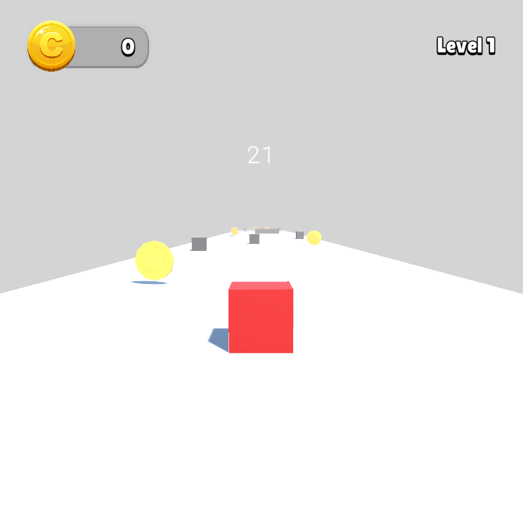
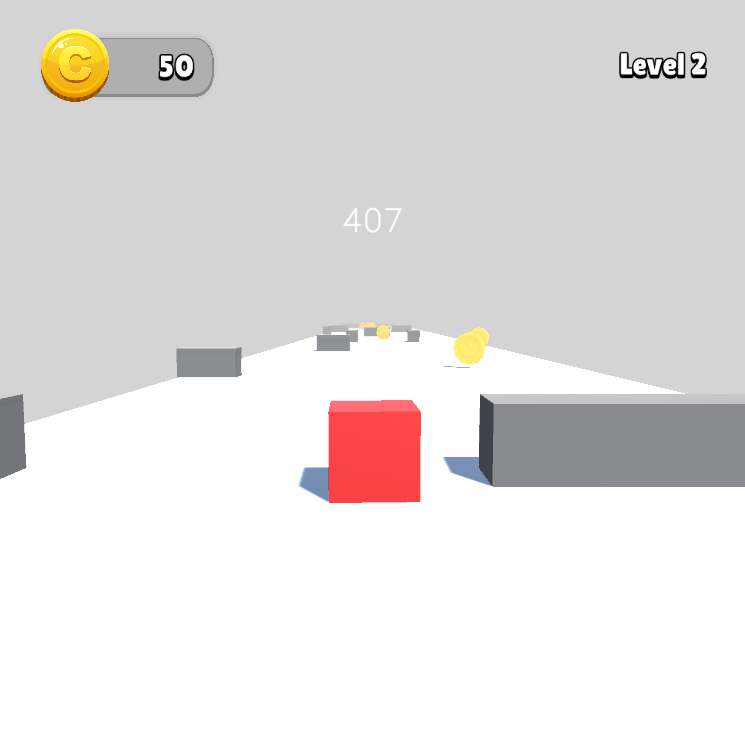
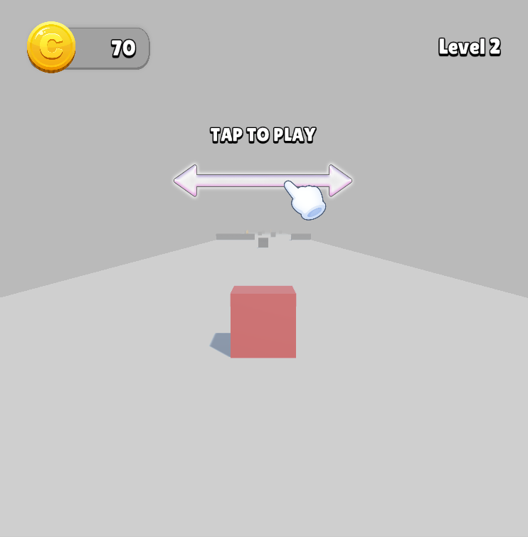

# Unity 3D Cube Runner

 

    

 

## Introduction

This project is a simple 3D runner project made in Unity. The player is a cube and their goal is to dodge the obstacles and collect as many coins as possible before reaching the end line.  

    
    

## Installation

To run the Cube Runner game on your Windows system, follow these steps:

&nbsp;&nbsp;&nbsp; 1. Clone this repository or download it as a ZIP file.  
&nbsp;&nbsp;&nbsp; 2. Open the project in Visual Studio or your preferred C++ IDE.  
&nbsp;&nbsp;&nbsp; 3. Build and run the project.    

### Downloading Release and Playing

You can easily download and play the game by following these steps:

&nbsp;&nbsp;&nbsp; 1. Go to the [Releases](https://github.com/AnastasyaDuygu/Cube-Runner/releases) section of this repository.  
&nbsp;&nbsp;&nbsp; 2. Find the latest release and click on it.  
&nbsp;&nbsp;&nbsp; 3. Download the ` WinConsoleCubeRunner.exe ` file from the release.  
&nbsp;&nbsp;&nbsp; 4. Run ` WinConsoleCubeRunner.exe ` to start playing the game !  

## How To Play
&nbsp;&nbsp;&nbsp; 1. Drag your finger left and right to sway the player left and right.  
&nbsp;&nbsp;&nbsp; 2. Dodge the rectangle/cube obstacles.  
&nbsp;&nbsp;&nbsp; 3. Don't fall off the platform.  
&nbsp;&nbsp;&nbsp; 4. Collect as many coins as you can.  

## Features

- "Tap To Play" screen at the start of each level.
- If player hits obstacles or gets out of the bounds of the platform, player dies, loses all their coins collected on that level and the level restarts.
- When player reaches the end of a level the next level is automatically loaded after a "Level Complete" screen.
- If all levels are completed player is met with a screen with the option to restart the game from the first level.
